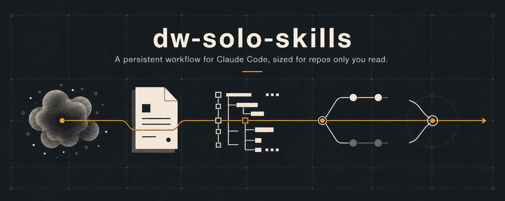
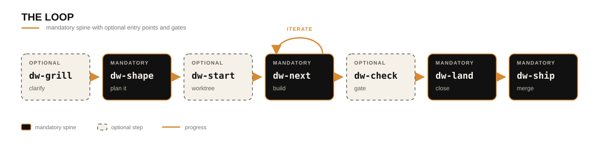

<p align="center">
  
</p>

<p align="center"><strong>A persistent workflow for Claude Code, sized for repos only you read.</strong></p>

<p align="center">
  
  
  
  
</p>

This is the **thin lane**: every skill here assumes one reader, and the loop carries only the
ceremony a solo change actually pays for.

## ◆ What this lane is for

Every skill written here has to earn its place against one failure mode of agentic coding, at the
smallest weight that still works:

- **Context dies on /clear** — the change lives in a tracked file under `.ai/work/`, not in the
  session, and is read back from disk rather than reconstructed from scrollback.
- **The agent runs on a wrong assumption** — a fuzzy idea gets interrogated into decisions before
  anything is written.
- **The process outweighs the change** — one artifact instead of spec + plan + notes, one gated pass
  instead of five auditors and a separate writer.
- **A private repo rots** — the change doc is archived at merge (`.ai/archive/`), and what's durable
  is **promoted** first: decisions to `docs/decisions/`, terms to `CONTEXT.md`, traps to the routed
  topic file that covers them, follow-ups to `.ai/backlog/`. Without that step you accumulate stale
  specs and lose the decisions worth keeping.
- **Commits drift from your conventions** — the repo's own `## Git conventions` are applied instead
  of generic defaults.

## ▸ Quick start

```
claude plugin marketplace add dominikwozniak/dw-solo-skills
claude plugin install dw-solo
claude plugin install dw-solo-setup
claude plugin install dw-solo-extras   # optional — off-loop skills
```

Then, in a project of your own: `/dw-init` scaffolds it, `/dw-shape` opens the first change.

## ◇ Task router — which skill for which task

A task may match several rows — read all that apply. `⭑` = explicit-invoke only: say its name (it
never auto-fires). The phrases that trigger each skill live in its own `description`, and the
arguments it takes in its own `argument-hint` — neither is copied here.

**Explicit-only skills**: `dw-start`, `dw-ship`, `dw-init`, `dw-handoff` and `dw-prune`. Marked `⭑` in the
router; they never auto-fire — say the name. Being invisible to the model, no other skill can delegate
to one; another skill suggesting you run it is the route in.

**The loop** — `?` marks the opt-in steps; the spine and what it guarantees are in
[`AGENTS.md`](AGENTS.md).

<p align="center">
  
</p>

Parallel changes: shape several on the default branch, then one worktree + session each via
`dw-start` or `claude -w <slug>`.

| Skill                                      | Task                                                           | What you get                                                             |
| ------------------------------------------ | -------------------------------------------------------------- | ------------------------------------------------------------------------ |
| [`dw-grill`](skills/dw-grill/SKILL.md)     | Interview a fuzzy idea into decisions — max five questions     | shared understanding (writes nothing)                                    |
| [`dw-shape`](skills/dw-shape/SKILL.md)     | Synthesize it into one goal + decisions + task checklist       | `.ai/work/<slug>/CHANGE.md` · backlog                                    |
| [`dw-start`](skills/dw-start/SKILL.md) `⭑` | Open a shaped change: worktree + branch + claim, then build    | `.claude/worktrees/<slug>` on branch `<slug>`                            |
| [`dw-next`](skills/dw-next/SKILL.md)       | Build step _and_ resume point (`status` reports and stops)     | code + ticked box + commit                                               |
| [`dw-check`](skills/dw-check/SKILL.md)     | Fast optional QA gate — delegates by default, else self-review | findings at `file:line`, fixed in-session                                |
| [`dw-land`](skills/dw-land/SKILL.md)       | One thin verdict, then promote, archive and open the PR        | `docs/decisions/` · `CONTEXT.md` · backlog · `.ai/archive/` · an open PR |
| [`dw-ship`](skills/dw-ship/SKILL.md) `⭑`   | Squash-merge that PR, tear the worktree down, sync, sweep      | merged default branch, clean tree                                        |

**Anytime**

| Skill                              | Task                                                     | What you get                 |
| ---------------------------------- | -------------------------------------------------------- | ---------------------------- |
| [`dw-git`](skills/dw-git/SKILL.md) | All git ops — commit / push / PR / sync / branch / stash | commits / PR per `AGENTS.md` |

**Off-loop** — the `dw-solo-extras` plugin; reached for beside the loop, not on the way from shape to
ship.

| Skill                                          | Task                                                           | What you get                 |
| ---------------------------------------------- | -------------------------------------------------------------- | ---------------------------- |
| [`dw-handoff`](skills/dw-handoff/SKILL.md) `⭑` | Compact the session mid-task — where you are, what's ruled out | `.ai/work/<slug>/HANDOFF.md` |
| [`dw-prune`](skills/dw-prune/SKILL.md) `⭑`     | Walk the backlog — drop, do, bundle, or leave each entry       | a shorter queue, one commit  |

**Setup** — the `dw-solo-setup` plugin; run once per repo.

| Skill                                    | Task                                                       | What you get                             |
| ---------------------------------------- | ---------------------------------------------------------- | ---------------------------------------- |
| [`dw-init`](skills/dw-init/SKILL.md) `⭑` | Scaffold a solo repo: `.ai/`, hooks, settings, `AGENTS.md` | tracked scaffold (+ optional pre-commit) |
| [`dw-doctor`](skills/dw-doctor/SKILL.md) | Diagnose tools, hooks, `AGENTS.md`, `.ai/` (read-only)     | health report + copy-paste fixes         |

## ⚙ How it works — the design in one screen

- **Persistence in the skill, not a wrapper.** Each `SKILL.md` writes its own `.ai/` path as part of
  its procedure, so the change doc lands automatically and travels with the installed plugin — no
  `.claude/commands/` glue layer.
- **`.ai/` is tracked, one folder per change, no central index.** A registry becomes a merge-conflict
  magnet once tracked; discovery is by directory name + frontmatter, matched to the git branch.
- **Persistent, then archived.** The change doc is tracked so a `/clear` changes nothing, and moved
  to `.ai/archive/` at merge so `work/` doesn't accumulate stale specs — a squash merge would
  otherwise erase its worked state from history. What's genuinely durable is still promoted out.
- **One gate, not a skill boundary.** The fuller workflow separates read-only auditors from the one
  writer so an auditor can't under-report what it couldn't fix. Here you read every finding yourself,
  so a single pass reports first and mutates only after explicit approval.
- **Thin harness, fat skills.** The process lives in the markdown, not in glue code — so every model
  upgrade improves the skills for free. (Inspired by
  ["Fat Skills"](https://x.com/garrytan/status/2042925773300908103).)
- **One always-loaded file, under a budget it declares itself.** The scaffold writes a **tracked**
  `AGENTS.md` with `CLAUDE.md` symlinked at it — rules, a Task Router into `docs/agents/`, and the two
  command bullets the hooks read. Tracked because a gitignored memory file reaches neither a fresh
  clone nor a worktree; one file because a second always-loaded one forks the corpus. A shipped
  zero-dependency checker holds the budget and the router honest.
- **Technology-agnostic.** Test/lint/run commands are read from your project (`AGENTS.md` →
  manifests → the code), never hardcoded.

## ▤ Project structure

The layout, and the one rule that comes with it — a skill is edited at `skills/<name>/SKILL.md` and
never through the `plugins/…` symlinks that point at it — are in
[`AGENTS.md`](AGENTS.md#layout--and-the-one-rule).

## ◆ Contributing

Layout, conventions and the gate live in [`AGENTS.md`](AGENTS.md) (`CLAUDE.md` is a symlink to it),
which routes onward — the add-a-skill checklist is in
[`docs/agents/skills-and-plugins.md`](docs/agents/skills-and-plugins.md).

## ▪ License

MIT
